# Steps for setting EKS Cluster on AWS


### 1. EC2 Setup

- Launch an Ubuntu instance.
- SSH into the instance from your local machine.

### 2. Install AWS CLI v2

```bash
curl "https://awscli.amazonaws.com/awscli-exe-linux-x86_64.zip" -o "awscliv2.zip"
sudo apt install unzip
unzip awscliv2.zip
sudo ./aws/install -i /usr/local/aws-cli -b /usr/local/bin --update
/usr/local/bin/aws --version
```

#### Configure AWS

- Create a **IAM User** `eks-Pro` with `AdministratorAccess`.
- Generate Security Credentials: **Access Key** and **Secret Access Key**.
- Configure your EC2 with keys created.

```bash
aws configure
```

### 3. Install kubectl

- [Link](https://docs.aws.amazon.com/eks/latest/userguide/install-kubectl.html) for the commands.
- Copy the binary to a folder in your `PATH`, use this [Link]().
  - **Reason** it will work after the reboot as well.

```bash
curl -O https://s3.us-west-2.amazonaws.com/amazon-eks/1.28.5/2024-01-04/bin/linux/amd64/kubectl
chmod +x ./kubectl
sudo mv ./kubectl /usr/local/bin/kubectl
kubectl version --client
```

### 4. Install eksctl

- [Link](https://docs.aws.amazon.com/emr/latest/EMR-on-EKS-DevelopmentGuide/setting-up-eksctl.html#setting-up-eksctl-linux) for the commands.

```bash
curl --silent --location "https://github.com/weaveworks/eksctl/releases/latest/download/eksctl_$(uname -s)_amd64.tar.gz" | tar xz -C /tmp
sudo mv /tmp/eksctl /usr/local/bin
eksctl version
```

### 5. Setup EKS Cluster

- It will create an EKS cluster named **"e-com-cluster"** in the **us-west-2 region** with a **node group** consisting of EC2 instances of type **t2.medium**. 
- The node group will have a minimum of 2 instances and a maximum of 2 instances.
- See all the options [here](../Resource/create-eks-cluster.md): `eksctl create cluster --help`

```bash
eksctl create cluster \
--name e-com-cluster \
--region us-west-2 \
--with-oidc \
--node-type t2.medium \
--nodes-min 2 \
--nodes-max 2
```

- **Cluster Created.**
  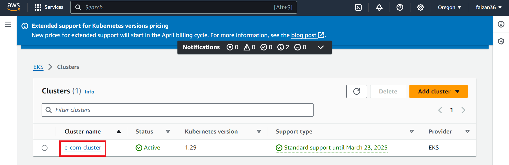

- **Worker Nodes**
  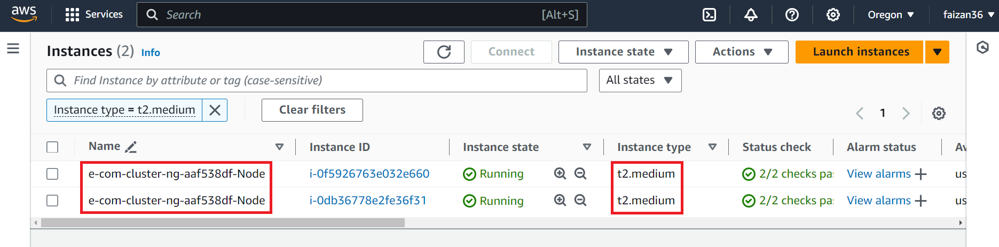

- Creates **Identity Provider** `--with-oidc`: OIDC allows your K8s cluster to use IAM for authentication to AWS services.
  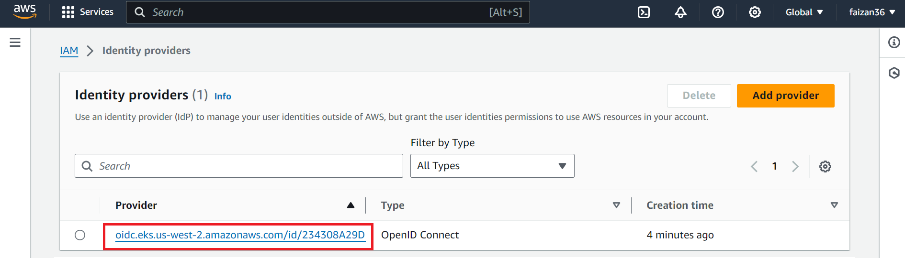

#### Create **kubeconfig** file automatically

```bash
aws eks update-kubeconfig --region us-west-2 --name e-com-cluster
kubectl get nodes
```

### 6. Install the AWS Load Balancer Controller using Helm

- [Link](https://docs.aws.amazon.com/eks/latest/userguide/lbc-helm.html) for documentaions.

#### 6.1 Create IAM Role using `eksctl`

- **First Command:** Download's the file `iam_policy.json`. 
- **Second Command:** Create an IAM policy using the policy downloaded in the previous step.

```bash
curl -O https://raw.githubusercontent.com/kubernetes-sigs/aws-load-balancer-controller/v2.7.1/docs/install/iam_policy.json

aws iam create-policy \
    --policy-name AWSLoadBalancerControllerIAMPolicy \
    --policy-document file://iam_policy.json
```

- **IAM policy Created**
  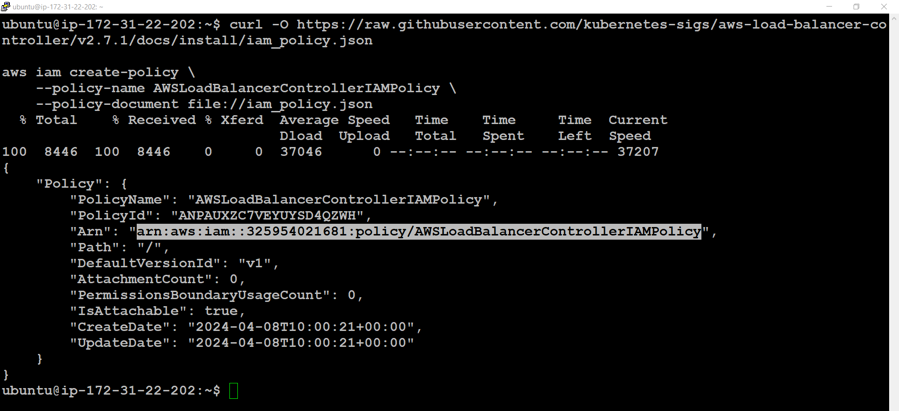
  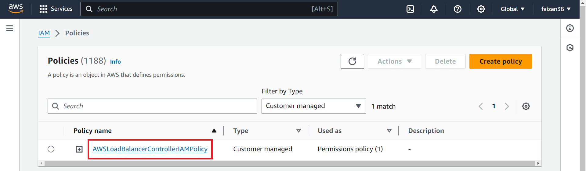


##### Create IAM Service Account `eksctl`.

> Replace <YOUR_AWS_ACC_NO> with your actual AWS account number.

```bash
eksctl create iamserviceaccount \
  --cluster=e-com-cluster \
  --namespace=kube-system \
  --name=aws-load-balancer-controller \
  --role-name AmazonEKSLoadBalancerControllerRole \
  --attach-policy-arn=arn:aws:iam::<YOUR_AWS_ACC_NO>:policy/AWSLoadBalancerControllerIAMPolicy \
  --region=us-west-2 \
  --approve
``` 

- **IAM Service Account Created**
  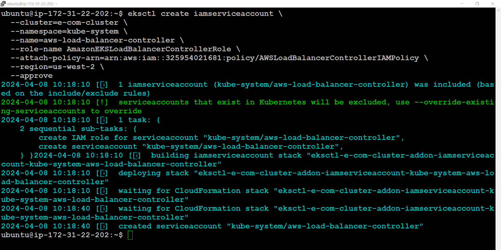

#### 6.2 Install AWS Load Balancer Controller

- Here we will install `aws-load-balancer-controller`, which is Pod that will create Application Load Balancer by reading the `ingress.yml` manifest, or we can say it will apply all the rules mentioned in `ingress.yml` to the ALB.

``` bash
sudo snap install helm --classic
helm repo add eks https://aws.github.io/eks-charts
helm repo update eks

helm install aws-load-balancer-controller eks/aws-load-balancer-controller \
  -n kube-system \
  --set clusterName=e-com-cluster \
  --set serviceAccount.create=false \
  --set serviceAccount.name=aws-load-balancer-controller 
```

- **Helm & AWS LB Installed**
  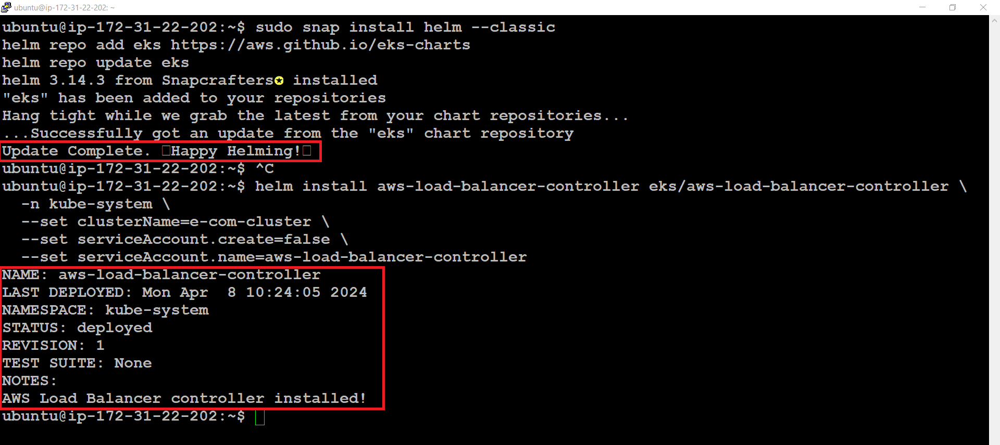

- **Load Balancer Created**
  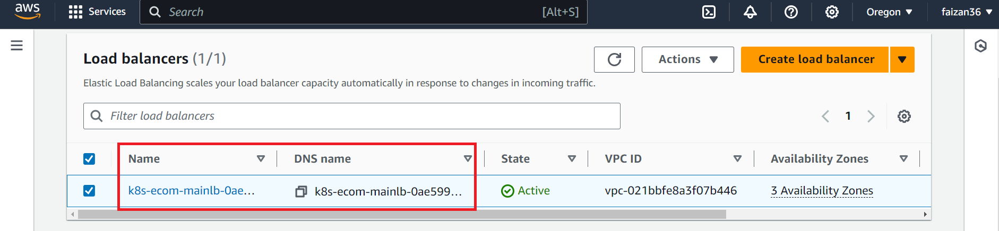


#### 6.3 Verify that the controller is installed

- Verify that the controller is installed.

```bash
kubectl get deployment -n kube-system aws-load-balancer-controller
```

- **Verify the controller**
  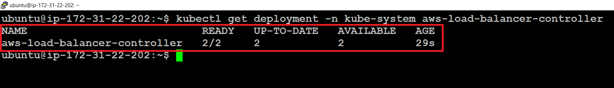


### 7. Apply Ingerss

``` bash
kubectl apply -f ingress.yml
```

``` bash
kubectl get ing -n e-com
```

- Copy the **ADDRESS**.

- **Ingerss Created**
  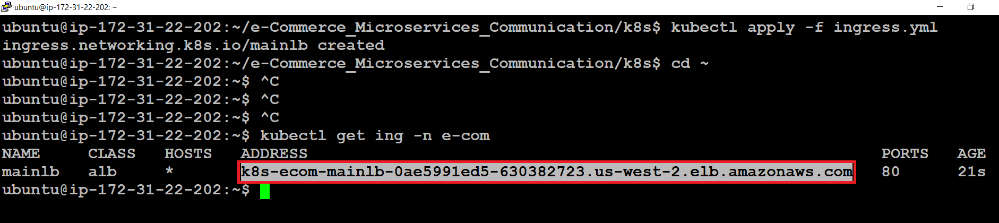


### 8. Apply k8s Manifests files

```bash
git clone https://github.com/faizan35/e-Commerce_Microservices_Communication.git
cd e-Commerce_Microservices_Communication/k8s
```

- Inside `frontend/` dir in `deployment.yml` manifest file replace the copied Ingress address.
  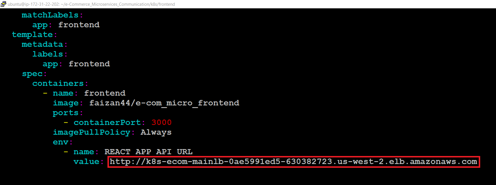


- Apply all with a script. (intentionally not created Helm Chart.)
  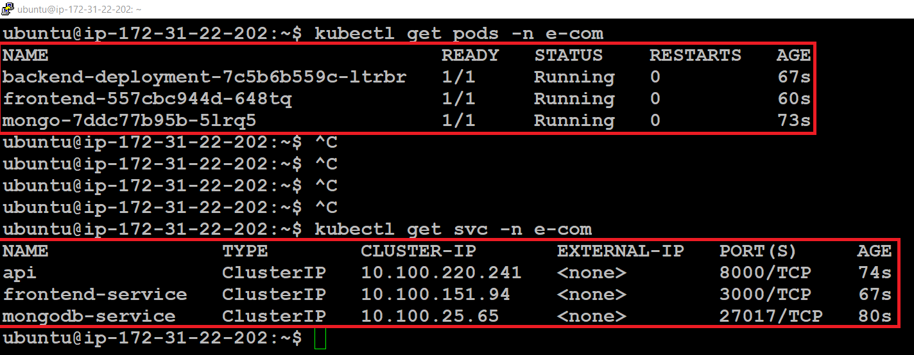

```bash
bash all-e-com-manifest.sh
```

### 9. Test the application

- Inside your web browser visit the same URL that you pasted in the frontend `deployment.yml` manifest file.
  

- You will see.
  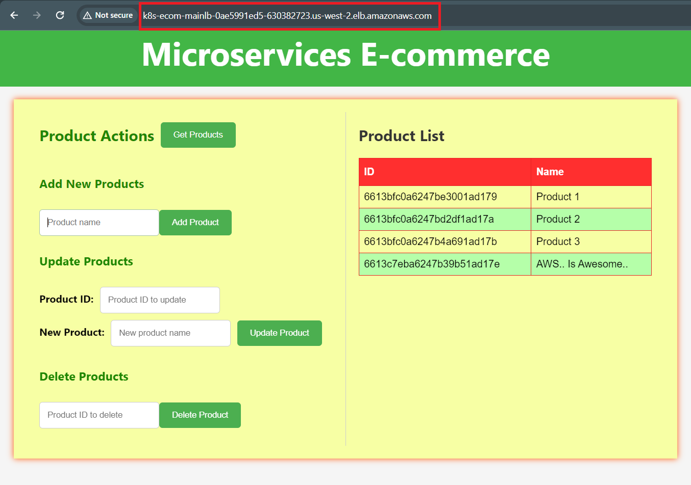

---

### Cleanup

- To delete the EKS cluster.

``` bash
eksctl delete cluster --name e-com-cluster --region us-west-2
```


