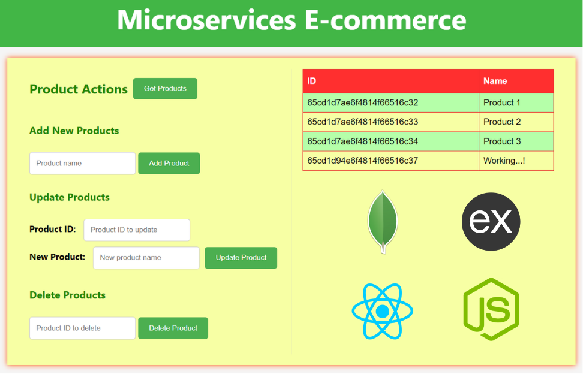

# Microservices E-commerce

## < --- In Progress --->

This project is designed as an example of an e-commerce application using **microservices architecture**. It consists of separate components for the backend, frontend, and a MongoDB database for storing product information.



## Getting Started for Develpment

**To run the project locally, follow these steps:**

##### 1. Clone Repo

```bash
git clone https://github.com/faizan35/e-Commerce_Microservices_Communication.git
```

```bash
cd e-Commerce_Microservices_Communication/
```

##### 2. cd and install

```bash
bash ./scripts/npm_install.sh
```

##### 3. Start ALL microservices (frontend, backend and database)

Open two teminals, execute both command in both of them.

```bash
node backend/backend.js
```

```bash
node frontend/server.js
```

Start your MongoDB Connection on `mongodb://localhost:27017`.

##### 4. Access the frontend in your browser at http://localhost:8080.

## Docker

### Build Docker Images

```bash
cd microservices-Communication-Project
```

```bash
bash ./scripts/build-docekr-img.sh
```

### Push each image to DockerHub

```bash
docker push faizan44/e_com-backend:latest
docker push faizan44/e_com-database:latest
docker push faizan44/e_com-frontend:latest
```

## k8s - Apply

```bash
bash ./apply-deployment-and-service-files.sh
```

## API Endpoints

- **GET /api/products** Retrieve the list of products.
- **POST /api/products** Add a new product.
- **PUT /api/products/:id** Update an existing product.
- **DELETE /api/products/:id** Delete a product.

## Frontend Usage

- Click the "**Get Products**" button to fetch and display the list of products.
- Add, update, or delete products using the respective sections on the webpage.

## Database

The project uses MongoDB to store product data. Ensure you have MongoDB installed and running locally.

## Technologies Used

- Node.js
- Express.js
- CORS
- MongoDB
- Mongoose
- HTML, CSS, JS

## Contributing

Feel free to contribute to the project by submitting issues or pull requests.

## License

This project is licensed under the MIT License - see the [LICENSE](./LICENSE) file for details.

---
