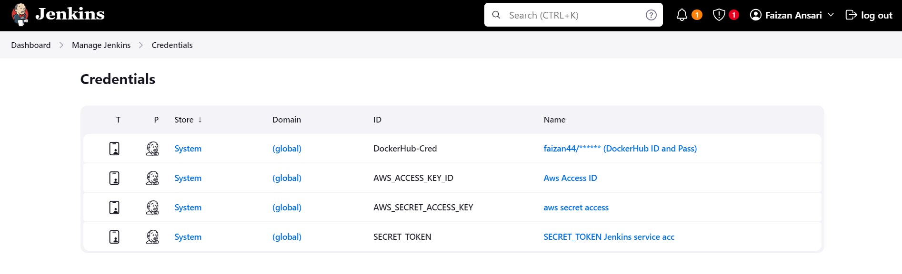
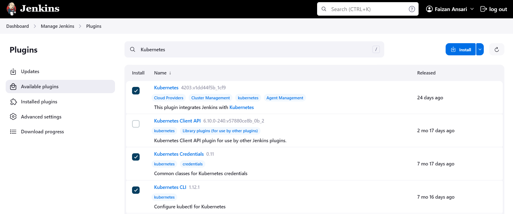
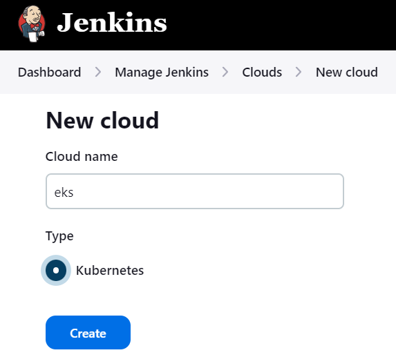
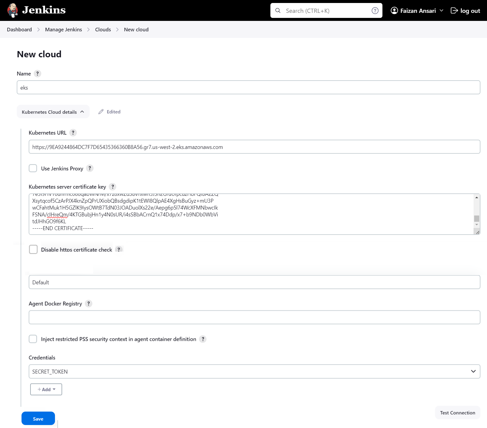
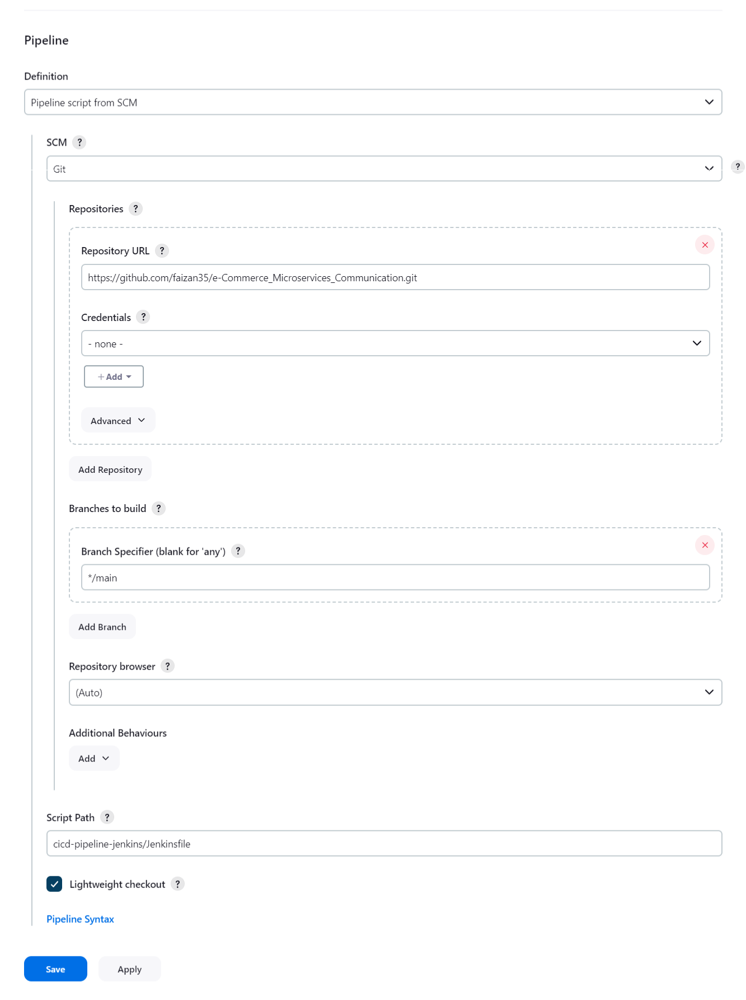
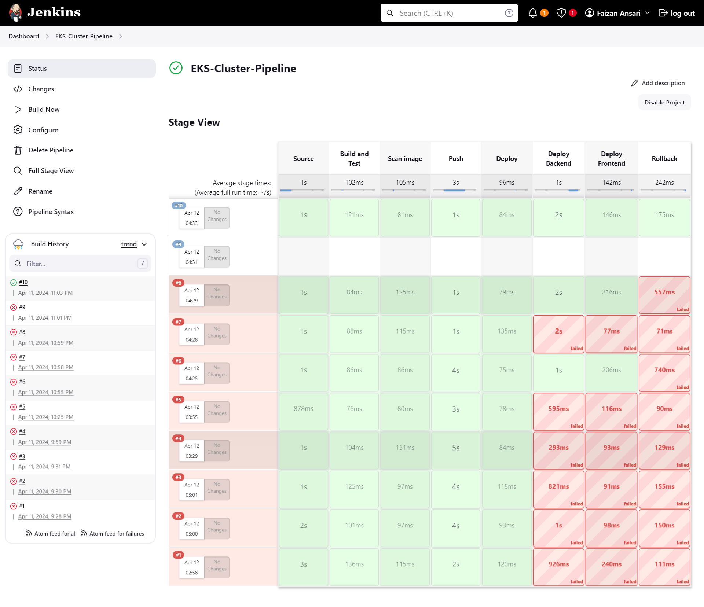

# Setting Jenkins CI/CD Pipeline

> Your ESK Cluster should be running.

### 1. Create Jenkins Server

- Follow this [instructions](../Jenkins-Steup-Terraform-Ansible/Setting-Jenkins-server.md) to create Jenkins server on AWS.

- Log into the Jenkins server.

### 2. Creating Credentials

- In Dashboard goto: **Manage Jenkins > Credentials**
- Click on **(global)**.
- then click on `+ Add Credentials` button.

#### We will create 4 Credentials

| Credential Name                   | Kind             | ID  (no change)    |
|-----------------------------------|-----------------------|--------------------|
| DockerHub Id and password         | Username with password | DockerHub-Cred     |
| AWS Access Key                    | Secret text           | AWS_ACCESS_KEY_ID  |
| AWS Secret Access Key             | Secret text           | AWS_SECRET_ACCESS_KEY |
| Service Account token for Jenkins | Secret text           | SECRET_TOKEN       |

1. For DockerHub set your ID and Password, in respective input field.
2. Paste your AWS Access Key, under **Secret**.
3. Paste your AWS Secret Access Key, under **Secret**.
4. Step's to set Service Account token for Jenkins - [Click here](./setting-token-jenkins.md)

### 3. Install Plugins for Kubernetes

Will require these three plugins.

- **Kubernetes**
- **Kubernetes CLI**
- **Kubernetes Credentials**

##### In Dashboard goto: **Manage Jenkins > Plugins**

- Install these plugins.

### 4. Setting remote K8s Cluster with Jenkins

- In Dashboard goto: **Manage Jenkins > Clouds**
- Click on **New cloud**. Plugins in previous step must be installed.
- Give a name and check **Kubernetes** checkbox then click **Create**.

- 

- Click on **Kubernetes Cloud details** dropdown.
- Fill all the related details from kubeconfig file. [See kubeconfig file](./kubeconfig)
  - **Kubernetes URL**: In kubeconfig file, under `clusters[0].cluster.server`.
  - **Kubernetes server certificate key**: In kubeconfig file, under `clusters[0].cluster.certificate-authority-data`, write the decodded value. **To decode:** [See Example no. 1](./examples.md)
  - **Kubernetes Namespace**: Any namespace you want, give "Default".
  - Credentials: Select previously created `SECRET_TOKEN`.
  - Finally check the k8s connenction by clicking on **`Test Connection`** button.
- Click on **Save** button.

### 5. Creating Pipeline

- In Dashboard click on: **+ New Item**
- **Enter an item name**: `EKS-Cluster-Pipeline` , Select `Pipeline` and Click **OK** button.
- Now under **Pipeline** > **Definition** > select **Pipeline script from SCM**
  - **SCM**: `Git`
  - **Repository URL**: `https://github.com/faizan35/e-Commerce_Microservices_Communication.git`
  - **Branch Specifier (blank for 'any')**: `*/main`
  - **Script Path**: `cicd-pipeline-jenkins/Jenkinsfile`
- Click on **Save**.

### 6. Finally Build Your Pipeline

- Click on **`Build Now`** button.

---
